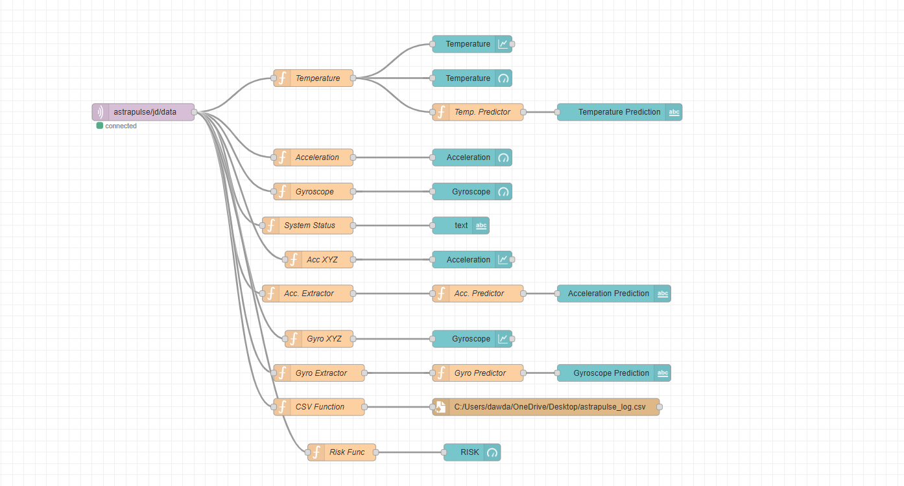
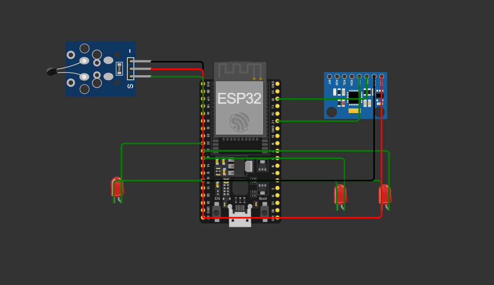

# AstraPulse


## 🚀 Overview

**AstraPulse** is a real-time IoT monitoring and predictive analytics system built using **ESP32, Wokwi, MQTT and Node-RED**.

The project captures live sensor data, transmits it using MQTT, processes the information inside Node-RED and visualizes it through interactive dashboards. AstraPulse also incorporates filtering/predictive logic using EWMA concepts for smoother monitoring and analysis.

---

## ✨ Features

- Real-time sensor monitoring  
- ESP32 + Wokwi simulation  
- MQTT-based communication  
- Node-RED dashboard and automation  
- Data processing and analytics  
- EWMA-based smoothing/prediction  
- Dashboard visualization  
- CSV/data logging support  

---

## 🛠 Tech Stack

| Layer | Technology |
|---|---|
| Hardware | ESP32 |
| Simulation | Wokwi |
| Communication | MQTT (HiveMQ) |
| Backend Logic | Node-RED |
| Programming | Arduino / C++ |
| Visualization | Node-RED Dashboard |

---

## 📡 Project Workflow

```text
Sensor → ESP32 → MQTT → Node-RED → Dashboard → Analytics
```

---

## 📁 Repository Structure

```text
AstraPulse/
├── wokwi/
├── node-red/
├── screenshots/
├── docs/
├── README.md
├── LICENSE
├── .gitignore
└── setup-guide.md
```

---

## ⚙️ Setup Guide

### 1. Wokwi Setup
Open the files inside the `wokwi/` folder.

### 2. Node-RED Setup
Import:

```text
node-red/flows.json
```

Install required palette nodes if prompted.

### 3. MQTT Setup
Configure your MQTT broker and credentials.

### 4. Run
Deploy Node-RED and start monitoring through the dashboard.

---

## 🖼 Project Screenshots


### dashboard1.png


### dashboard2.png


### dashboard3.png


### node-red-flow.png


### wokwi-circuit.png



---

## 📜 License

This project is licensed under the **MIT License**.

---

## 👨‍💻 Author

Developed as part of the **AstraPulse IoT monitoring project**.
