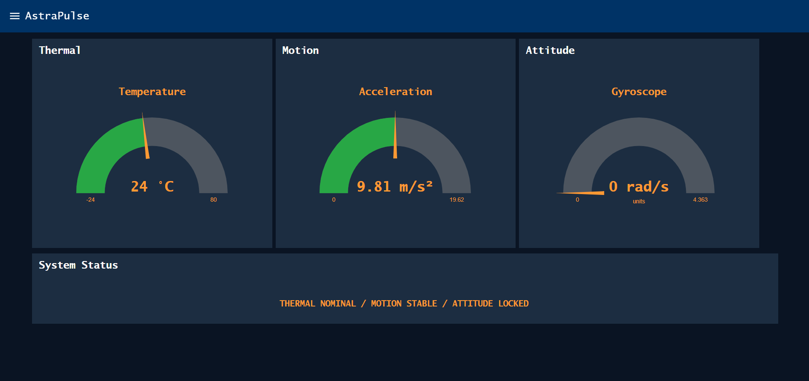
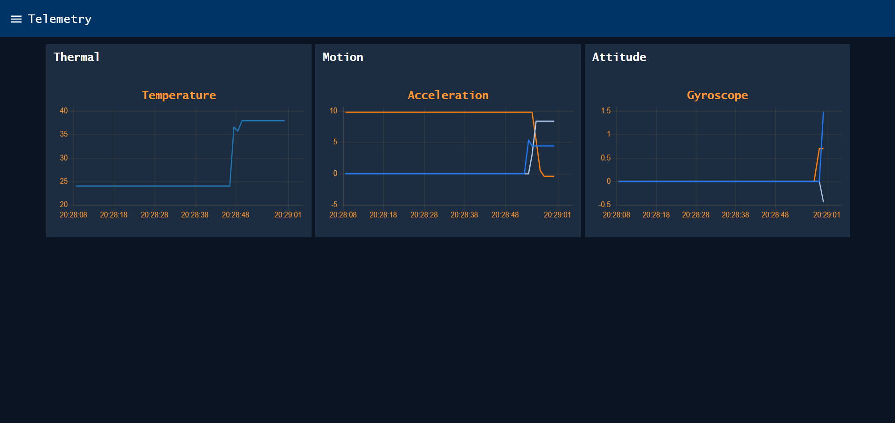
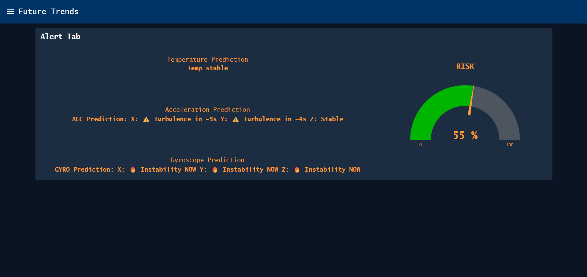

# AstraPulse

## Transforming Sensor Data into Actionable Intelligence

AstraPulse is a real-time IoT telemetry and predictive analytics platform built using ESP32, MQTT, Wokwi, and Node-RED. Rather than simply displaying sensor readings, AstraPulse converts raw telemetry into meaningful operational intelligence through monitoring, historical analysis, and future trend prediction.

The project was designed around a simple philosophy:

**Observe → Analyze → Predict**

AstraPulse demonstrates how modern IoT systems can evolve beyond data collection and become intelligent monitoring platforms capable of identifying patterns, highlighting risks, and supporting decision-making.

---

# Problem Statement

Most beginner IoT projects stop after displaying sensor values.

A dashboard showing:

- Temperature = 31°C
- Acceleration = 0.42g
- Gyroscope = 12 deg/s

provides information but not insight.

Users still need to determine:

- Is the system healthy?
- Is temperature increasing?
- Is motion becoming unstable?
- Are current readings abnormal?
- What might happen next?

AstraPulse was developed to answer these questions by combining monitoring, telemetry analytics, and predictive intelligence into a unified architecture.

---

# Project Objectives

- Build a real-time IoT monitoring platform.
- Integrate ESP32 with Node-RED through MQTT.
- Visualize sensor behavior through dashboards.
- Track historical telemetry trends.
- Reduce sensor noise using EWMA techniques.
- Generate predictive insights from live data.
- Demonstrate industry-style monitoring workflows.

---

# System Architecture

```text
Sensors
   │
   ▼
ESP32
   │
   ▼
MQTT Broker
   │
   ▼
Node-RED Processing Layer
   │
 ┌─┼─────────────┬─────────────┐
 ▼ ▼             ▼             ▼
Monitoring   Telemetry   Prediction
Dashboard    Dashboard   Dashboard
```

## Sensor Layer

The sensing layer captures environmental and motion-related data.

Data sources include:

- Temperature sensing
- Motion sensing
- Attitude/orientation sensing

These sensors continuously generate real-time telemetry that becomes the foundation of the AstraPulse analytics pipeline.

## ESP32 Layer

The ESP32 serves as the edge controller.

Responsibilities include:

- Reading sensor values
- Formatting telemetry packets
- Managing WiFi connectivity
- Publishing MQTT messages
- Preparing data for processing

## MQTT Communication Layer

MQTT acts as the communication backbone of AstraPulse.

Benefits:

- Lightweight protocol
- Low latency
- Scalable architecture
- Event-driven messaging

Sensor readings are transmitted efficiently between the ESP32 and Node-RED processing environment.

## Node-RED Processing Layer

Node-RED serves as the analytical core.

Responsibilities:

- Data ingestion
- Data transformation
- Dashboard updates
- Trend generation
- Prediction calculations
- Risk assessment

---

# Hardware Components

| Component | Purpose |
|------------|----------|
| ESP32 | Main controller |
| MPU6050 | Motion and attitude sensing |
| Temperature Sensor | Thermal monitoring |
| MQTT Broker | Data transport |
| Node-RED | Processing and visualization |
| Dashboard UI | User interaction layer |

---

# Sensor Data Pipeline

AstraPulse follows a structured telemetry pipeline.

## Step 1: Data Acquisition

Sensors continuously collect environmental and motion information.

## Step 2: Edge Processing

ESP32 performs initial acquisition and formatting.

## Step 3: MQTT Publishing

Processed readings are published to MQTT topics.

## Step 4: Data Reception

Node-RED subscribes to the MQTT topics and receives telemetry in real time.

## Step 5: Processing

Incoming values are analyzed and prepared for visualization.

## Step 6: Analytics

Historical and predictive calculations are performed.

## Step 7: Visualization

Results are displayed through dedicated dashboards.

---

# Dashboard 1 – Real-Time Monitoring Center



The Monitoring Dashboard serves as the operational command center of AstraPulse.

Its primary purpose is to answer one question:

**What is happening right now?**

## Thermal Module

The thermal gauge displays live temperature readings.

This allows operators to:

- Monitor environmental conditions
- Detect overheating
- Identify thermal instability
- Observe sudden changes

The gauge format was selected because temperature is most useful as an immediate operational metric.

## Motion Module

The motion gauge visualizes acceleration data received from the MPU6050.

The module enables monitoring of:

- Vibrations
- Sudden impacts
- Dynamic movement
- Stability conditions

Real-time updates allow users to identify disturbances immediately.

## Attitude Module

The attitude section visualizes gyroscope activity.

This subsystem monitors:

- Rotation
- Angular velocity
- Orientation changes
- Rotational stability

## System Status Engine

The status indicators summarize overall system health.

Rather than forcing users to interpret multiple values simultaneously, AstraPulse converts sensor information into clear operational states.

---

# Dashboard 2 – Telemetry & Historical Analytics



Dashboard 2 focuses on understanding how the system behaves over time.

While Dashboard 1 provides snapshots, Dashboard 2 provides context.

## Temperature Trend Analysis

The temperature chart records thermal behavior continuously.

Users can identify:

- Gradual heating
- Cooling patterns
- Thermal spikes
- Drift behavior
- Long-term trends

## Acceleration Trend Analysis

The motion chart tracks acceleration history.

This enables:

- Vibration analysis
- Shock event detection
- Pattern identification
- Stability evaluation

Unlike a gauge, the chart reveals how movement evolves over time.

## Gyroscope Trend Analysis

Rotational history is plotted through dedicated telemetry charts.

This enables:

- Oscillation detection
- Orientation monitoring
- Stability assessment
- Angular trend analysis

## Why Telemetry Matters

Telemetry transforms raw measurements into actionable observations.

Instead of simply asking:

"What is the current value?"

Engineers can ask:

"How has the system behaved during the last several minutes?"

This distinction is critical for diagnostics and troubleshooting.

---

# Dashboard 3 – Future Trends & Predictive Intelligence



Dashboard 3 represents the intelligence layer of AstraPulse.

Instead of showing only present or historical information, AstraPulse attempts to estimate future behavior.

## Temperature Prediction Engine

Recent thermal activity is analyzed to determine future trends.

Potential outcomes:

- Stable conditions
- Increasing temperature
- Emerging thermal risk

## Motion Prediction Engine

Motion trends are evaluated to identify:

- Developing instability
- Emerging vibrations
- Abnormal movement patterns
- Potential disturbances

## Gyroscope Prediction Engine

Rotational behavior is analyzed to estimate future stability.

This approach allows potential issues to be identified before they become operational problems.

## Risk Assessment Module

The Risk Gauge combines:

- Temperature behavior
- Motion activity
- Attitude stability
- Predictive analytics

into a unified health score.

This provides a single indicator of overall system confidence.

---

# EWMA Prediction Methodology

Sensor data is naturally noisy.

Small fluctuations often create misleading spikes that reduce readability.

To address this challenge, AstraPulse incorporates Exponential Weighted Moving Average (EWMA) concepts.

Formula:

EWMA_t = αX_t + (1−α)EWMA_(t−1)

Benefits:

- Noise reduction
- Smoother trends
- Better prediction stability
- Improved anomaly detection

This allows AstraPulse to focus on meaningful changes rather than random fluctuations.

---

# Features

## Current Features

- Real-time monitoring
- MQTT communication
- ESP32 integration
- Node-RED dashboards
- Telemetry visualization
- Historical trend analysis
- Risk assessment
- Predictive analytics
- EWMA filtering

## Planned Features

- Cloud deployment
- Mobile dashboard
- Alert notifications
- Machine learning forecasting
- Multi-device support
- Remote monitoring

---

# Engineering Challenges

During development several technical challenges were encountered:

## MQTT Integration

Ensuring reliable communication between ESP32 and Node-RED.

## Real-Time Dashboard Updates

Maintaining responsive visualization without introducing latency.

## Sensor Noise

Raw sensor values often contain fluctuations that can distort interpretation.

## Trend Prediction

Developing meaningful forecasts from limited telemetry data.

## Dashboard Design

Presenting large amounts of information without overwhelming users.

---

# Learning Outcomes

Through AstraPulse the following skills were developed:

- Embedded systems programming
- ESP32 development
- MQTT communication
- Node-RED workflows
- Dashboard engineering
- Data visualization
- Telemetry systems
- Predictive analytics
- Sensor integration
- IoT architecture design

---

# Future Scope

AstraPulse can be expanded into:

- Industrial monitoring platforms
- Predictive maintenance systems
- Smart manufacturing environments
- Fleet telemetry systems
- Drone monitoring platforms
- Autonomous robotics analytics
- Environmental monitoring systems

---

# Screenshots

## Monitoring Dashboard
Displays live operational status and real-time sensor readings.

## Telemetry Dashboard
Provides historical charts and trend visualization.

## Future Trends Dashboard
Delivers predictive analytics and risk assessment capabilities.

---

# License

This project is licensed under the MIT License.

---

# Author

**JD (Jay Dawda)**

Electronics Engineering Student  
Embedded Systems & IoT Enthusiast
